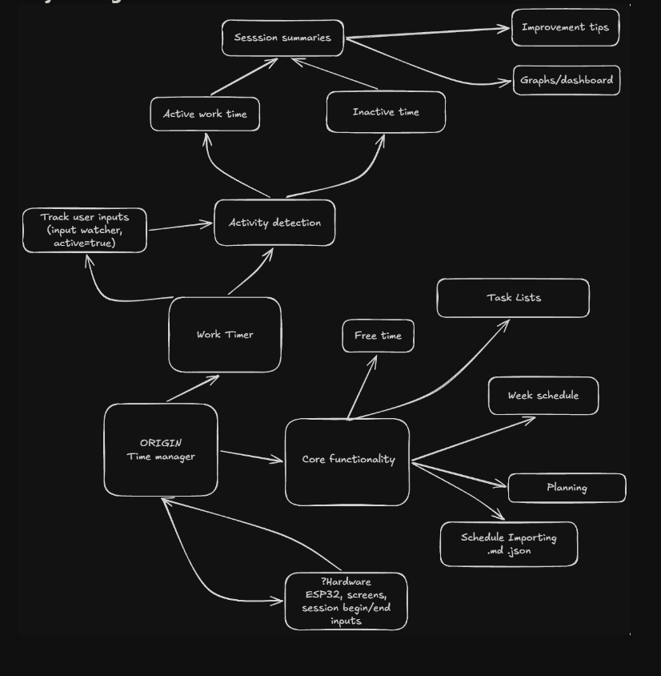

# timeManager

> Personal scheduler, time tracker, work timer, and free-time management application.

**timeManager** is a personal productivity application designed to help manage time without turning the entire day into a rigid schedule.

The core idea is simple:

**Plan your time → work → track your activity → analyze your time → improve.**

The application combines a flexible daily/weekly scheduler with an activity-aware work timer that distinguishes between **active work time** and **inactive time**.

---

# Project Diagram


# Planned Technology

| Component | Technology |
|---|---|
| Language | **Python** |
| GUI | **Textual** |
| Schedule / configuration | **JSON / Markdown** |
| Activity detection | Keyboard / mouse input monitoring |
| Hardware | **ESP32** |

**Textual** is planned as the primary GUI framework because the application is heavily centered around timers, information panels, task lists, dashboards, keyboard interaction, and real-time state changes.

---

## Development Status
```text
[ ] Core application structure
[ ] Task management
[ ] Schedule system
[ ] Free-time calculation
[ ] Work Timer
[ ] Activity detection
[ ] Session tracking
[ ] Session summaries
[ ] Data persistence
[ ] Analytics / dashboard
[ ] Markdown / JSON import & export
[ ] Hardware integration
```

## - 373